# Forecasting Walmart Sales

## Question
Given a data set with five and a half years of product sales, how accurately can I predict Walmart sales down to the day?

## Introduction
In 2019, Walmart was the largest retailer in sales beating second place by more than three times (Amazon). Behind the scenes, a massive support operation is conducted in order to make sure customer demand is met with appropriate customer service and supply of product. 

The goal of my project is to use real Walmart data to build a forecasting model that can accurately predict sales for any given product in any given month. The application of this model will allow for better customer service and increased sales. It also will allow for a better understanding of the trend and seasonality of Walmart's business. This information will be able to help staff departments in order to meet customer demand, and also make sure that the appropriate supply from vendors is maintained to meet that demand. The information to be gained from this model has many benefits and a wide breadth of application.

The complexities of this model are vast for a multitude of reasons. The future contains an element of unpredictability. However, elements can be extrapolated from historical data which can be used to make predictions about the future. My methodology, analysis, and results will be explored in the remainder of this report.

## Data
The data set comes from Kaggle.com. It contains three files: 1) The training set (to be discussed), 2) A Calendar, and 3) a list of products and their sales price. The data set covers sales from Jan 2011- April 2016.

The majority of my work was done in the training data set. This file contains a data set, which is 30,490 rows by 1,919 columns. This means that there are 30,490 individual products and 1,913 days of sales for each product. The remaining six columns include a product id, item id, department id, , category id, store id, and state id. The data set contains product information from 3 states (California, Texas, and Wisconsin), 3 categories of products (Food, Hobby, and Household), 7 departments (3 for the Food category, and 2 each for Hobby and Household), and 10 stores (4 in CA, and 3 in TX/WI). It's also important to note that Walmart anonymized their data so product IDs do not give much information about the actual product.

## Forecasting Methodology
For this project, I used time series analysis. While there are several methods to forecast using time series, I used a trend and seasonality approach. In a given category, I made a line of best fit and set that as the trend. I then extrapolated the seasonality, which remains constant over time, and added in that component to the trend depending on which month I was forecasting. I also decided to forecast on the monthly sales, as opposed to the daily sales, in order to smooth the trend and seasonality.

Here are two sets of images that were primarily used in my analysis:

Here is a plot of Walmart's total sales and a trendline:
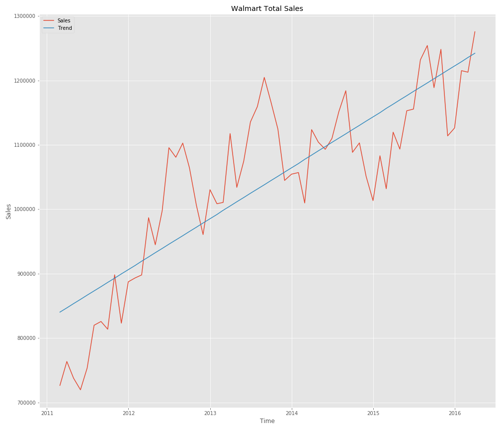

Here is a plot of the raw data, trend, seasonality, and residuals for Walmart's total sales:
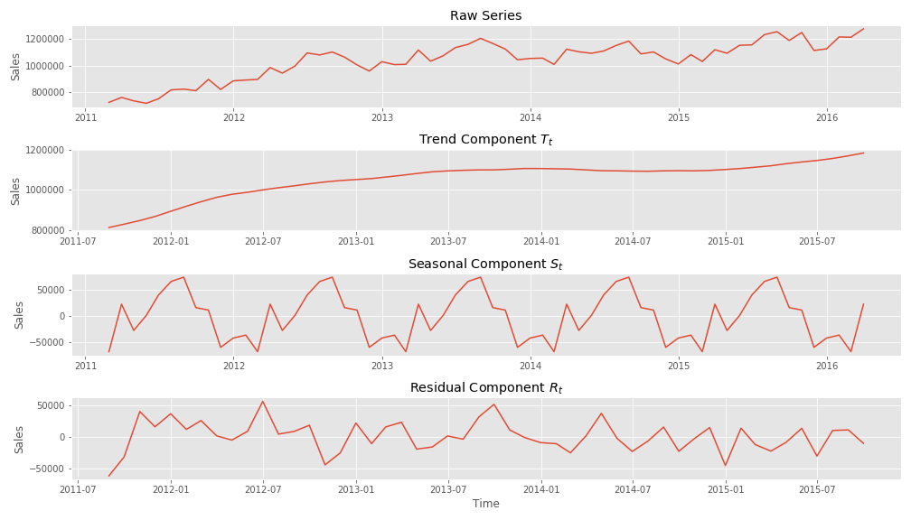

Here is a plot of the CA3 store and Foods3 department sales and a trendline:
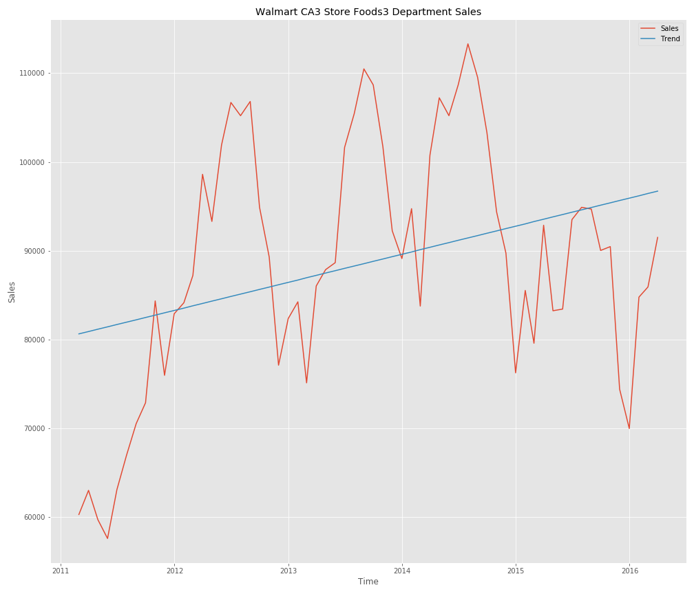

Here is a plot of the raw data, trend, seasonality, and residuals for the CA3 store and Foods3 department sales:
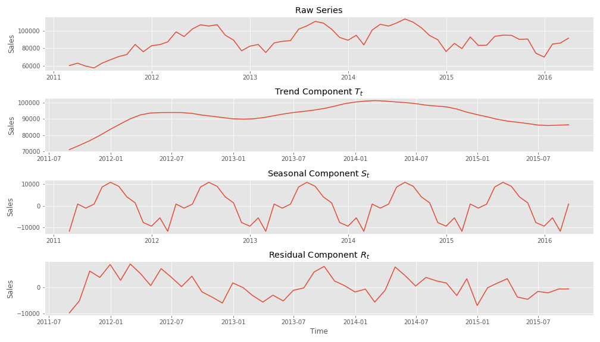

The second and fourth graph is a trend, seasonal, and residual plot. I used the seasonality component from these plots and the blue trendline from the first and third graph to conduct my analysis.

The overarching forecasting was conducted this way:
* Forecast = Trend + Seasonality

Since the trendline is a straight line, it can be used to predict the future. And then the seasonality is added in to adjust for the month.

## Analysis
Because Walmarts sales are dependent on the departments and the stores (which are influenced by the categories, states, and overall Walmart trends), I spent a lot of time thinking about how I would A) generate a forecast and then B) apply that forecast to the individual level. I decided to forecast at a higher level almost immediately because I felt that it would be more volatile to forecast on the individual product level since many items only sparsely sell during the month. For all of my analysis, I tested my accuracy by predicting February and March 2016 since I had data for these months already. This allowed me to assess any error and make adjustments.

My original blueprint was as follows:

1) Forecast Total Walmart Sales
2) Trickle down the forecast to the individual level by multiplying the means of each sub category until I got to the store and department level.
3) Use the store/department level forecast to figure out individual product sales for the month
4) Figure out how products typically sell through the course of the month to find the daily sales

For this test, I decided to predict along the following pipeline:
1) Total Sales for February
2) Percent of total sales allocated to the Foods Category
3) Percent of total Foods sales allocated to the Foods 3 department.
4) Percent of total Foods 3 Department sales allocated to California.
5) Percent of total California sales allocated to the CA3 store.

Here are some images that represent the different percentages that I multiplied to the total sales for Feb. I used the mean for the different sections, but I tried to think carefully about where the mean should be. Sometimes, I used all historical data. Other times, I used part of the historical data to account for major swings in sales.

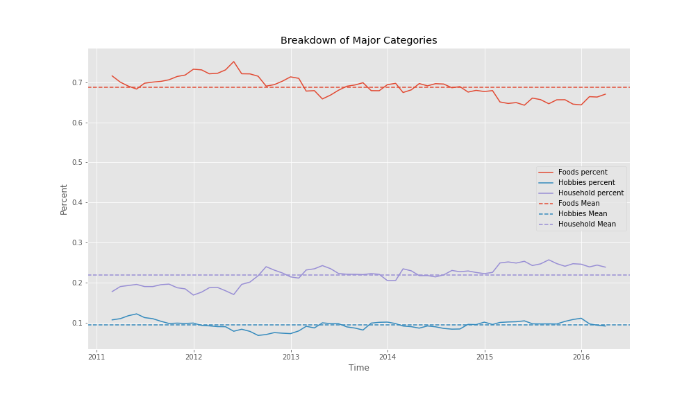

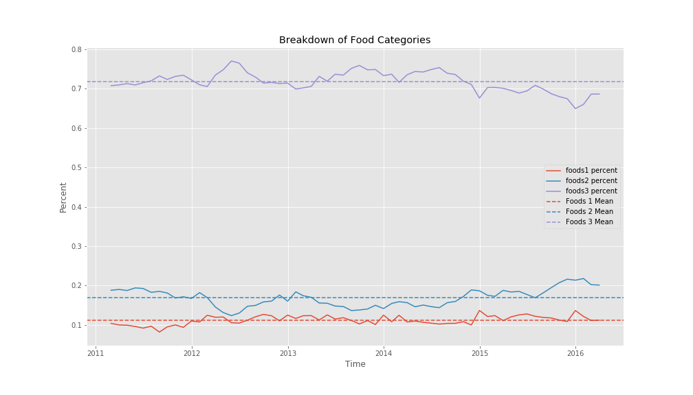

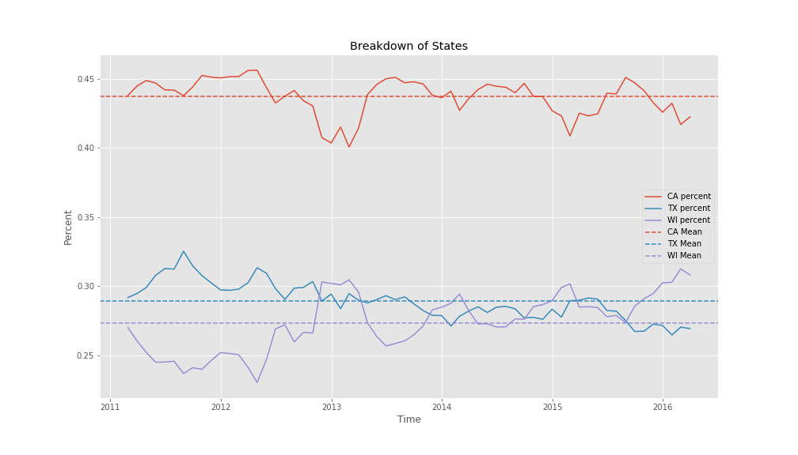

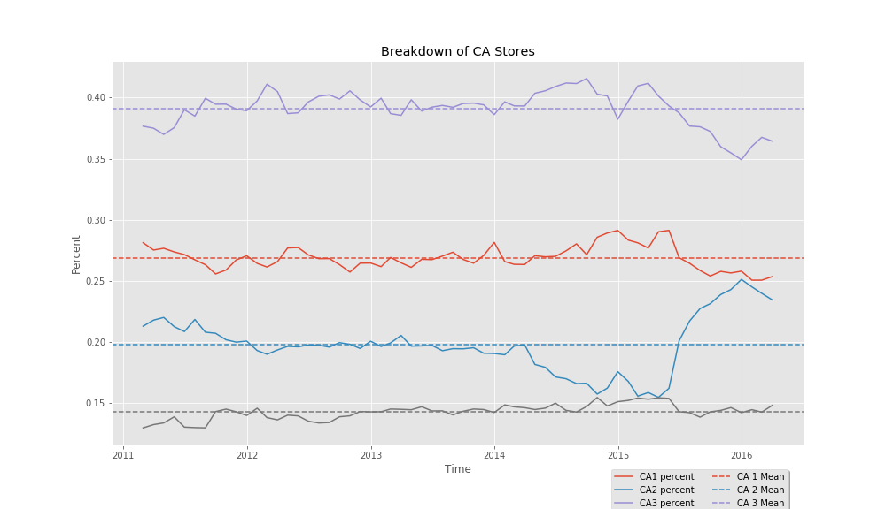

(See the results section below for forecast results)

After I made my forecast for the month of February, I got concerned that by trickling down the pipeline that there would be data loss (due to the assumptions made such as the means). I decided that I needed to forecast directly on the CA3 store and Foods3 Department and and then compare my results to the trickle down method. By comparing two forecasting methods, I increased the likelihood that I would be using the most accurate forecast. 

I compared my results from the trickle down forecast to the direct forcast and noticed that my accuracy was significantly improved forecasting directly on the store and department. I decided to purse this forecasting strategy as my primary method from this point forward.

Now that I had my forecast at the Store and Department level, it was now time to work on breaking that forecast down to the individual product level. The workflow that I used is as follows:

1) Look at the 2015 breakdown for what percentage of total sales were associated with a given item. At this location and in this department, there are about 800 products. I decided to look at 2015 only because not every product was sold every year.
2) Look at the daily distribution in a given month by analyzing how the product sold every day in the month and averaging that together (for example, average what percent of total sales for the product occured on Feb 1 from 2011-2015).
3) Multiply the forecast to the product percentage and then use the daily distribution to scatter the sales over the month.

(See the results for more information)

You'll see in the results section that without any rounding, I am predicting partial units to be sold. Of course this isn't possible, so I rounded the results. It turns out that the rounding can have a significant effect on the final units sold (for example, rounding can change 16.4 units to 12 units or 16.4 units to 24 units depending on how I round).

I discovered that even though the workflow worked as intended, there is still more room to conduct more tests to assess the accuracy of the model. For the sake of time, I was only able to test this total workflow on one sample item.

## Results

| Trickle Down Forecast | Path |
| ----------- | ----------- |
| Feb 2016 Forecast | 1,166,909 Units |
| Food Category | x 67% | 
| Food 3 Department | x 70% |
| California State | x 43% | 
| CA3 Store | x 39% |
| Forecast for CA3 store Foods 3 Dept | = 92,050 Units | 

| Trickle Down Forecast | Result |
| ----------- | ----------- |
| Feb 2016 Forecast | 1,166,909 Units |
| Feb 2016 Actual | 1,264,510 Units|
| Error | 7.8%|

| Trickle Down Forecast | Result |
| ----------- | ----------- |
| Trickle Down Forecast Feb/2016 for CA3 store Foods3 Dept | 92,050 Units |
| Actual Feb/2016 for CA3 store Foods3 Dept | 85,925 Units|
| Error | 7.1%|

| Trickle Down Forecast | Result |
| ----------- | ----------- |
| Direct Forecast for CA3 store Foods3 Dept | 85,647 Units |
| Actual Feb/2016 for CA3 store Foods3 Dept | 85,925 Units|
| Error | .32%| 

Daily Distribution Results (no rounding):

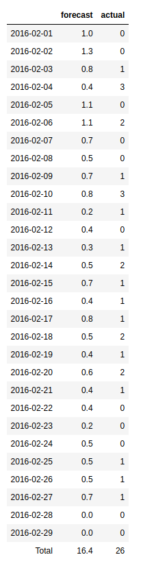

Daily Distribution Results (rounding up at >= .5):

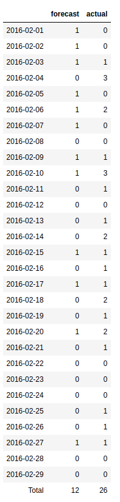

Daily Distribution Results (rounding up at >= .4):

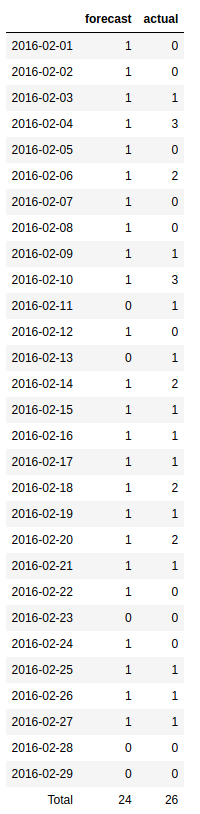

## Conclusion
In conclusion, I accomplished my primary objective which was to build a model that can predict unit sales. I was able to build my model in a way where any individual product can be tested and reviewed.

To Do:
* Conduct more tests to establish the validity of the model
* Explore more complex forecasting methodology such as ARIMA
* Continue to adjust and review how the daily distribution compares to the final results
* Examine weekly patterns in order to improve the daily distribution
* Adjust daily distribution for holidays and events that may affect sales

This project was very exciting to work on and I look forward to continuing my analysis. The implications for this model have major strategic benefits to businesses.

#### References
* https://www.kaggle.com/c/m5-forecasting-accuracy